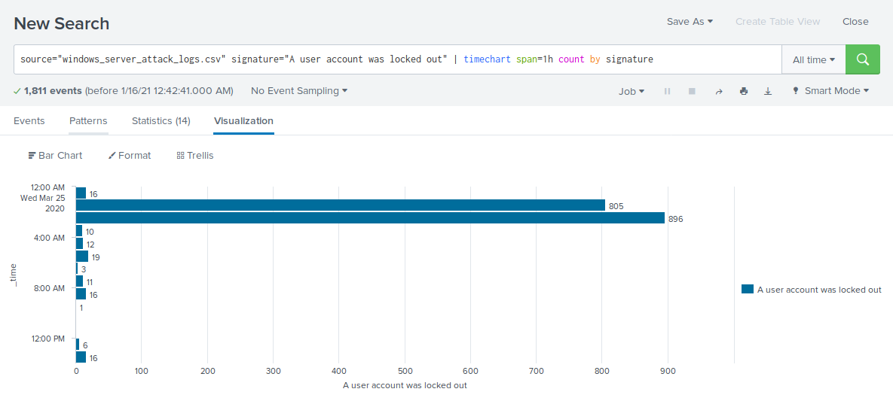
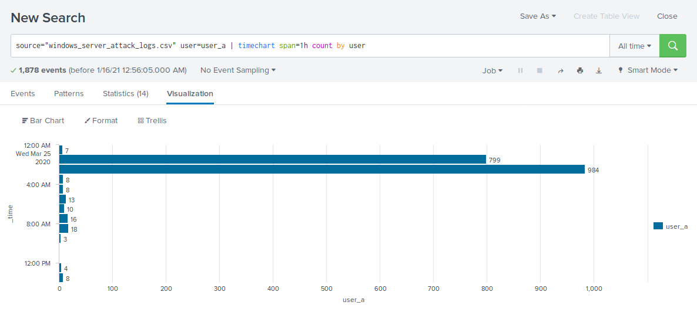
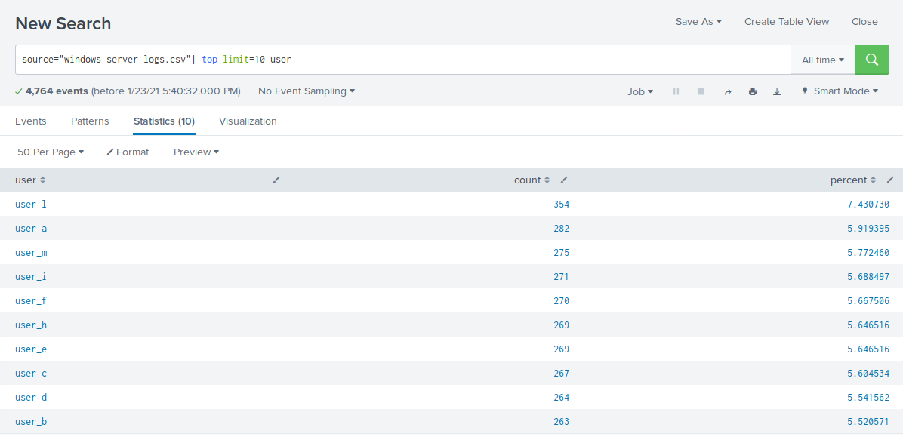

# Splunk_SOC_Assignment

In this activity, I played the role of a SOC analyst hired by Virutal Space Industries (VSI) tasked with using Splunk to monitor against potential attacks from JobeCorp.

## Activity File: Part 1 - Master of the SOC

- Each group is playing the role of an SOC analyst at a small company called Virtual Space Industries (VSI), which designs virtual reality programs for businesses.

- VSI has heard rumors that a competitor, JobeCorp, may be launching cyberattacks to disrupt VSI's business.

- As SOC analysts, you are tasked with using Splunk to monitor against potential attacks on your systems and applications.

- Your Networking team has provided you with past logs to help you develop baselines and create reports, alerts, and dashboards.

You've been provided the following logs:

- **Windows Server Logs**

   - This server contains intellectual property of VSI's next-generation virtual reality programs.
   - [Windows Server Logs](Resources/windows_server_logs.csv)
   - [Windows Server Attack Logs](Resources/windows_server_attack_logs.csv)

- **Apache Server Logs**

   - This server is used for VSI's main public-facing website vsi-company.com.
   - [Apache Logs](Resources/apache_logs.txt)
   - [Apache Attack Logs](Resources/apache_attack_logs.txt)

### Windows Server Logs Instructions and Deliverables

1. Load the logs into your Splunk environment.

   - Select all default options provided.
   - **Important**: For the time range, select **All Time**.

2. Analyze the logs and the available fields.

3. Design the following deliverables to protect VSI from potential attacks by JobeCorp.

   - **Reports**: Design the following reports to assist VSI with quickly identifying specific information.

       - A report with a table of signatures and associated SignatureID.

           - This will allow VSI to easily view reports that show the ID number with a specific signature of the Windows activity.

             **Hint**: Research how to remove the duplicate values in your SPL search.

         `source="windows_server_logs.csv" | table signature signature_id | dedup signature`

         

       - A report that provides the count and percent of the severity.

           - This will allow VSI to quickly know the severity levels of the Windows logs being viewed.

         `source="windows_server_logs.csv" | top severity`

         

       - A report that provides a comparison between the success and failure of Windows activities.

           - This will show VSI if there is a suspicious level of failed activities on their server.

             **Hint**: Check the `status` field for this information.

         `source="windows_server_logs.csv" status=failure`
 
         

   - **Alerts**: Design the following alerts to notify VSI of suspicious activity:

       - Determine a baseline and threshold for hourly level of failed Windows activity.

           - Create an alert to trigger when the threshold has been reached.
           - The alert should trigger an email to SOC@VSI-company.com.

               - Baseline for failed hourly attempts: 6.
               - Threshold for failed hourly attempts: 15.

         `source="windows_server_logs.csv" status=failure`
 
         

       - Determine a baseline and threshold for hourly count of the signature: **an account was successfully logged on**.

           - Create an alert to trigger when the threshold has been reached.
           - The alert should trigger an email to SOC@VSI-company.com.

               - Baseline for hourly success of logged on accounts: 12.
               - Threshold for hourly success of logged on accounts: 30.

         `source="windows_server_logs.csv" signature="An account was successfully logged on"`

         

       - Determine a baseline and threshold for hourly count of the signature: **a user account was deleted**.

           - Design the alert based on the corresponding SignatureID, as the signature name sometimes changes when the Windows system updates.
           - Create an alert to trigger when the threshold has been reached.
           - The alert should trigger an email to SOC@VSI-company.com.

               - Baseline for hourly deleted user accounts: 13. 
               - Threshold for hourly deleted user accounts: 50.

         `source="windows_server_logs.csv" signature_id=4726`

         

   - **Visualizations and Dashboards**: Design the following visualizations and add them to a dashboard called Windows Server Monitoring:

       **Hint**: Add the following after your search: `timechart span=1h count by signature`.

       - A line chart that displays the different `signature` field values over time.

         `source="windows_server_logs.csv" | timechart span=1h count by signature`

         

       - A line chart that displays the different `user` field values over time.

         `source="windows_server_logs.csv" | timechart span=1h count by user`

         

       - A bar, column, or pie chart that illustrates the count of different signatures.

         `source="windows_server_logs.csv" | top limit=10 signature`

         

       - A bar, column, or pie chart that illustrates the count of different users.

         `source="windows_server_logs.csv" | top limit=10 user`

         

       - A statistical chart that illustrates the count of different users.

         `source="windows_server_logs.csv" | top limit=10 user`

         

       - One single value visualization of your choice: radial gauge, marker gauge, etc.

         `source="windows_server_logs.csv" signature="special privleges assigned to new logon" | timechart span=1h count by signature`

         

4. On your dashboard, add the ability to change the time range for all your visualizations.

   

   - Be sure to title all your panels appropriately.

   - Align your dashboard panels as you see fit.

### Apache Web Server Instructions and Deliverables

1. Load the logs into your Splunk environment.

   - Select all default options provided.
   - **Important**: For the time range, select **All Time**.

2. Analyze the logs and the available fields.

3. Design the following deliverables to protect VSI from potential attacks by JobeCorp:

   - **Reports**: Design the following reports to assist VSI with quickly identifying specific information:

       - A report that shows a table of the different HTTP methods (GET, POST, HEAD, etc).

           - This will provide insight into the type of HTTP activity being requested against their web server.

           `source="apache_logs.txt" | top method`

           

       - A report that shows the top 10 domains that referred to VSI's website.

           - This will assist VSI with identifying suspicious referrers.

           `source="apache_logs.txt" | top limit=10 referer_domain`

           

       - A report that shows the count of the HTTP response codes.

           - This will provide insight into any suspicious levels of HTTP responses.

           `source="apache_logs.txt" | top status`

           

   - **Alerts**: Design the following alerts:

       - Determine a baseline and threshold for hourly activity from a country other than the United States.

           - Create an alert to trigger when the threshold has been reached.
           - The alert should trigger an email to SOC@VSI-company.com.

               - Baseline for hourly activity is 80
               - Threshold for hourly activity is 170

           `source="apache_logs.txt" | iplocation clientip | where Country!="United States"`

           

       - Determine an appropriate baseline and threshold for hourly count of the HTTP POST method.

           - Create an alert to trigger when the threshold has been reached.
           - The alert should trigger an email to SOC@VSI-company.com.

               - Baseline for hourly count of HTTP POST method is 2
               - Threshold for hourly count of HTTP POST method is 12

           `source="apache_logs.txt" method=POST`

           

   - **Visualizations and Dashboards**: Design the following visualizations and add them to a dashboard called Apache WebServer Monitoring.

       **Hint**: Add the following after your search: `timechart span=1h count by method`.

       - A line chart that displays the different HTTP `methods` field over time.

           `source="apache_logs.txt" | timechart span=1h count by method`

           

       - A cluster map showing the locations based on the `clientip` field.

           `source="apache_logs.txt" | iplocation clientip | geostats count`

           

       - A bar, column, or pie chart that displays the number of different URIs.

           `source="apache_logs.txt" | top limit=10 uri`

           

       - A bar, column, or pie chart that displays the counts of the top 10 countries.

           `source="apache_logs.txt" | iplocation clientip | top limit=10 Country`

           

       - A statistical chart that illustrates the count of different user agents.

           `source="apache_logs.txt" | top limit=10 useragent`

           

       - One single value visualization of your choice: radial gauge, marker gauge, etc.

           `source="apache_logs.txt" status=200 | timechart span=1h count by status`

           

4. On your dashboard, add the ability to change the time range for all your visualizations:

   

   - Be sure to title all your panels appropriately.
   - Align your dashboard panels as you see fit.

## Activity File: Part 2 - Defend Your SOC

- VSI recently experienced several cyberattacks, likely from their adversary JobeCorp.

- Fortunately, your SOC team had set up several monitoring solutions to help VSI quickly identify what was attacked.

- These monitoring solutions will also help VSI create mitigation strategies to protect the organization.

You have been provided two logs files of suspicious activity:

- One for a Windows Server.

   - [Windows Server Attack Logs](Resources/windows_server_attack_logs.csv)

- One for an Apache Web Server.

   - [Apache Attack Logs](Resources/apache_attack_logs.txt)

### Windows Server Logs

Load the logs in your Splunk environment.

- Select all default options provided.
- **Important**: For the time range, always select **All Time**.

Now you will review the reports you created in Part 1 and analyze the results.

#### Report Analysis for Severity

1. Access the **Reports** tab and select **Yours** to view the reports created from Part 1.

2. Select the report you created to analyze the different severities.

3. Select **Edit** > **Open in Search**.

4. Take note of the percentages of different severities.

5. Change the source from `source="windows_server_logs.csv"` to `source="windows_server_attack_logs.csv"`.

6. Select **Save**.

Review the updated results and answer the following question:

 `source="windows_server_logs.csv" | top severity`

 

 `source="windows_server_attack_logs.csv" | top severity`

 

- Did you detect any suspicious changes in severity?

    - Informational: Went from 93% to 80% resulting in a 13% decrease.
    - High: Went from 7% to 20% resulting in a 13% increase.
    - These results suggest there are suspicious changes in severity.

#### Report Analysis for Failed Activities

1. Access the **Reports** tab and select **Yours** to view the reports created from Part 1.

2. Select the report you created to analyze the different activities.

3. Select **Edit** > **Open in Search**.

4. Take note of the failed activities percentage.

5. Change the source from `source="windows_server_logs.csv"` to `source="windows_server_attack_logs.csv"`.

6. Select **Save**.

Review the updated results and answer the following question:

 `source="windows_server_logs.csv" | top status`

 

 `source="windows_server_attack_logs.csv" | top status`

 

- Did you detect any suspicious changes in failed activities?

    - Success: Went from 97% to 98% resulting in a 1% increase.
    - Failure: Went from 3% to 2% resulting in a 1% decrease.
    - These results suggest there were no major changes in failed activities.

Now you will review the alerts you created in Part 1 and analyze the results.

#### Alert Analysis for Failed Windows Activity

1. Access the **Alerts** tab and select **Yours** to view the alerts created in Part 1.

2. Select the alert for suspicious volume of failed activities.

3. Select **Open in Search**.

4. Change the source from `source="windows_server_logs.csv"` to `source="windows_server_attack_logs.csv"`.

Review the updated results and answer the following questions:

 `source="windows_server_logs.csv" status=failure`

 

 `source="windows_server_attack_logs.csv status-failure`

 

- Did you detect a suspicious volume of failed activity?

    - There was potential for a suspicious volume of failed activity at 8:00 a.m. on Wednesday, March 25th.  

- If so, what was the count of events in the hour(s) it occurred?

    - The count of activity was 35 events during this hour.

- When did it occur?

    - 8:00 a.m. on Wednesday, March 25th.

- Would your alert be triggered for this activity?

    - Yes, the alert is within the trigger threshold. 

- After reviewing, would you change your threshold from what you previously selected?

    - No change in threshold necessary.

#### Alert Analysis for Successful Logons

1. Access the **Alerts** tab and select **Yours** to view the alerts created in Part 1.

2. Select the alert of suspicious volume of successful logons.

3. Select **Open in Search**.

4. Change the source from `source="windows_server_logs.csv"` to `source="windows_server_attack_logs.csv"`.

Review the updated results, and answer the following questions:

 `source="windows_server_logs.csv” signature="An account was successfully logged on"`

 

 `source="windows_server_attack_logs.csv" signature="An account was successfully logged on"`

 

- Did you detect a suspicious volume of successful logons?

    - There was potential for suspicious activity at 11:00 a.m. and 12:00 p.m. on Wednesday, March 25th. 

- If so, what was the count of events in the hour(s) it occurred?

    - The count of activity is 196 events at 11:00 a.m. and 77 events at 12:00 p.m.

- Who is the primary user logging in?

    - The primary user logging in was user_j.

- When did it occur?

    - The suspicious activities occurred at 11:00 a.m. and 12:00 p.m. on Wednesday, March 25th. 

- Would your alert be triggered for this activity?

    - Yes, the alert is within the trigger threshold. 

- After reviewing, would you change your threshold from what you previously selected?

    - No change in threshold necessary.

#### Alert Analysis for Deleted Accounts

1. Access the **Alerts** tab and select **Yours** to view the alerts created in Part 1.

2. Select the alert of suspicious volume of deleted accounts.

3. Select **Open in Search**.

4. Change the source from `source="windows_server_logs.csv"` to `source="windows_server_attack_logs.csv"`.

Review the updated results and answer the following question:

 `source="windows_server_logs.csv” signature_id=4726`

 

 `source="windows_server_attack_logs.csv” signature_id=4726`

 

- Did you detect a suspicious volume of deleted accounts?

    - There were no signs of suspicious volumes of deleted accounts.

Now you will set up a dashboard and analyze the results.	

#### Dashboard Setup

1. Access the **Windows Server Monitoring** dashboard.

   - Select **Edit**.

2. Access each panel you created and complete the following:

   - Select **Edit Search**.

   - Change the source from: `source="windows_server_logs.csv"` to `source="windows_server_attack_logs.csv"`.

   - Select **Apply**.

   - Save the dashboard.

   - Edit the time on the dashboard to be **All Time**.

#### Dashboard Analysis for Time Chart of Signatures

Analyze your new dashboard results and answer the following questions:

 `source="windows_server_logs.csv” signature="A user account was locked out" | timechart span=1h count by signature`

 

 `source="windows_server_attack_logs.csv” signature="A user account was locked out" | timechart span=1h count by signature`

 

 `source="windows_server_logs.csv” signature="An attempt was made to reset an accounts password" | timechart span=1h count by signature`

 

 `source="windows_server_attack_logs.csv” signature="An attempt was made to reset an accounts password" | timechart span=1h count by signature`

 

- Does anything stand out as suspicious?

   - There was suspicious activity with the signature “An account was locked out” from 12:00 a.m. to 3:00 a.m. on Wednesday, March 25th and with the signature “An attempt was made to reset an accounts password” from 8:00 a.m. to 11:00 a.m. on Wednesday, March 25th. 

- Which signatures stand out?

   - “A user account was locked out” signature stands out for suspicious activity.
   - “An attempt was made to reset an accounts password” signature stands out for suspicious activity.

- What time did it begin/stop for each signature?

   - A user account was locked out: Started at 12:00 a.m. on Wednesday, March 25th and stopped at 3:00 a.m. on Wednesday, March 25th.
   - An attempt was made to reset an accounts password: Started at 8:00 a.m on Wednesday, March 25th and stopped at 11:00 a.m. on Wednesday, March 25th.

- What is the peak count of the different signatures?

   - A user account was locked out: Peak count during the attack was at 896.
   - An attempt was made to reset an accounts password: Peak count  during the attack was at 1,258.

#### Dashboard Analysis for Time Chart of Users

Analyze your new dashboard results and answer the following questions:

 `source="windows_server_logs.csv” user=user_a | timechart span=1h count by user`

 

 `source="windows_server_attack_logs.csv” user=user_a | timechart span=1h count by user`

 

 `source="windows_server_logs.csv” user=user_k | timechart span=1h count by user`

 

 `source="windows_server_attack_logs.csv” user=user_k | timechart span=1h count by user`

 

- Does anything stand out as suspicious? 

    - There was suspicious activity at 12:00 a.m. and 3:00 a.m. on Wednesday, March 25th and at 9:00 a.m. and 10 a.m. on Wednesday, March 25th. 

- Which users stand out?

    - user_a and user_k stand out for suspicious activity.

- What time did it begin and stop for each user?

    - user_a: Started at 12:00 a.m. on Wednesday, March 25th and stopped at 3:00 a.m. on Wednesday, March 25th.
    - user_k: Started at 8:00 a.m on Wednesday, March 25th and stopped at 11:00 a.m. on Wednesday, March 25th.

- What is the peak count of the different users?

    - user_a: Peak count was at 984.
    - user_k: Peak count was at 1,256.

#### Dashboard Analysis for Signatures with Bar, Graph, and Pie Charts

Analyze your new dashboard results and answer the following questions:

 `source="windows_server_logs.csv” signature="A user account was locked out" | timechart span=1h count by signature`

 

 `source="windows_server_attack_logs.csv” signature="A user account was locked out" | timechart span=1h count by signature`

 

 `source="windows_server_logs.csv” signature="An attempt was made to reset an accounts password" | timechart span=1h count by signature`

 

 `source="windows_server_attack_logs.csv” signature="An attempt was made to reset an accounts password" | timechart span=1h count by signature`

 

- Does anything stand out as suspicious?

    - There was suspicious activity starting at 12:00 a.m. and 3:00 a.m. on Wednesday, March 25th and at 8:00 a.m. and 11 a.m. on Wednesday, March 25th. 

- Which signatures stand out?

    - “A user account was locked out” signature stands out for suspicious activity.
    - “An attempt was made to reset an accounts password” signature stands out for suspicious activity.

- What time did it begin/stop for each signature?

    - A user account was locked out: Started at 12:00 a.m. on Wednesday, March 25th and stopped at 3:00 a.m. on Wednesday, March 25th.
    - An attempt was made to reset an accounts password: Started at 8:00 a.m on Wednesday, March 25th and stopped at 11:00 a.m. on Wednesday, March 25th.

- What is the peak count of the different signatures?

    - A user account was locked out: Peak count was at 896.
    - An attempt was made to reset an accounts password: Peak count was at 1,258.

- Do the results match your findings in your time chart for signatures?

    - Yes, the results were synonymous with the findings.

#### Dashboard Analysis for Users with Bar, Graph, and Pie Charts

Analyze your new dashboard results, and answer the following questions:

 `source="windows_server_logs.csv” user=user_a | timechart span=1h count by user`

 

 `source="windows_server_attack_logs.csv” user=user_a | timechart span=1h count by user`

 

 `source="windows_server_logs.csv” user=user_k | timechart span=1h count by user`

 

 `source="windows_server_attack_logs.csv” user=user_k | timechart span=1h count by user`

 

- Does anything stand out as suspicious? 

    - There was suspicious activity at 12:00 a.m. and 3:00 a.m. on Wednesday, March 25th and at 9:00 a.m. and 10 a.m. on Wednesday, March 25th. 

- Which users stand out?

    - user_a and user_k stand out for suspicious activity.

- What time did it begin and stop for each user?

    - user_a: Started at 12:00 a.m. on Wednesday, March 25th and stopped at 3:00 a.m. on Wednesday, March 25th.
    - user_k: Started at 8:00 a.m on Wednesday, March 25th and stopped at 11:00 a.m. on Wednesday, March 25th.

- What is the peak count of the different users?

    - user_a: Peak count was at 984.
    - user_k: Peak count was at 1,256.

- Do the results match your findings in your time chart for users?

    - Yes, the results were synonymous with the findings.

#### Dashboard Analysis for Users with Statistical Charts

Analyze your new dashboard results, and answer the following question:

 `source="windows_server_logs.csv" | top limit=10 user`

 

 `source="windows_server_attack_logs.csv" | top limit=10 user`

 

- What are the advantages and disadvantages of using this report, compared to the other user panels you created?

    - An advantage of a statistical chart is a concise list of the top users accused of suspicious activity. A disadvantage of the statistical chart is that it shows a cumulative perspective of data while other approaches to data representation show a shorter, more specific perspective of data.

### Apache Web Server Logs

Load the logs in your Splunk environment.

- Select all default options provided.

- **Important**: For the time range, always select **All Time**.

Now you will review the reports you created in Part 1 and analyze the results.

#### Report Analysis for Methods

1. Access the **Reports** tab and select **Yours** to view the reports created from Part 1.

2. Select the report that analyzes the different HTTP methods.

3. Select **Edit** > **Open in Search**.

4. Take note of the percent/count of the various methods.

5. Change the source from: `source="apache_logs.txt"` to `source="apache_attack_logs.txt"`.

6. Select **Save**.

Review the updated results and answer the following questions:

 `source="apache_logs.txt" | top method`

 

 `source="apache_attack_logs.txt" | top method`

 

- Did you detect any suspicious changes in HTTP methods? If so which one?

    - Get: Yes, there was a suspicious decrease in GET activity by 29%.
    - Post: Yes, there was a suspicious increase in POST activity by 29%.

- What is that method used for?

    - POST is used to submit or update information to a web server.

#### Report Analysis for Referrer Domains

1. Access the **Reports** tab and select **Yours** to view the reports created from Part 1.

2. Select the report that analyzes the different referrer domains.

3. Select **Edit** > **Open in Search**.

4. Take note of the different referrer domains.

5. Change the source from: `source="apache_logs.txt"` to `source="apache_attack_logs.txt"`.

6. Select **Save**.

Review the updated results, and answer the following question:

 `source="apache_logs.txt" | top limit=10 referer_domain`

 

 `source="apache_attack_logs.txt" | top limit=10 referer_domain`

 

- Did you detect any suspicious changes in referrer domains?

    - There were no suspicious referrer domains during the attack.

#### Report Analysis for HTTP Response Codes

1. Access the **Reports** tab and select **Yours** to view the reports created from Part 1.

2. Select the report that analyzes the different HTTP response codes.

3. Select **Edit** > **Open in Search**.

4. Take a note of the different HTTP response codes.

5. Change the source from: `source="apache_logs.txt"` to `source="apache_attack_logs.txt"`.

6. Select **Save**.

Review the updated results and answer the following question:

 `source="apache_logs.txt" | top status`

 

 `source="apache_attack_logs.txt" | top status`

 

- Did you detect any suspicious changes in HTTP response codes?

    - There are several small changes overall, but the most suspicious change detected was the 404 response code increasing from 2% to 15%.

Now you will review the alerts you created in Part 1 and analyze the results.

#### Alert Analysis for International Activity

1. Access the **Alerts** tab and select **Yours** to view the alerts created in Part 1.

2. Select the alert of suspicious volume of international activity.

3. Select **Open in Search**.

4. Change the source from: `source="apache_logs.txt"` to `source="apache_attack_logs.txt"`.

Review the updated results and answer the following questions:

 `source="apache_logs.txt" | iplocation clientip | where Country!="United States"`

 

 `source="apache_attack_logs.txt" | iplocation clientip | where Country!="United States"`

 

- Did you detect a suspicious volume of international activity?

    - Yes, there was a suspicious volume of activity in Ukraine at 8:00 p.m. on March 25th.

- If so, what was the count of the hour it occurred in?

    - Ukraine had a count of 1,369 events during the 8:00 p.m. attack.

- Would your alert be triggered for this activity?

    - Yes, the alert is within the trigger threshold. 

- After reviewing, would you change the threshold you previously selected?

    - No change in threshold necessary.

#### Alert Analysis for HTTP POST Activity

1. Access the **Alerts** tab and select **Yours** to view the alerts created in Part 1.

2. Select the alert of suspicious volume of HTTP POST activity.

3. Select **Open in Search**.

4. Change the source from: `source="apache_logs.txt"` to `source="apache_attack_logs.txt"`.

Review the updated results, and answer the following questions:

 `source="apache_logs.txt" method=POST`

 

 `source="apache_attack_logs.txt" method=POST`

 

- Did you detect any suspicious volume of HTTP POST activity?

    - Yes, there was a suspicious increase of POST method activities. 

- If so, what was the count of the hour it occurred in?

    - There was a total count of 1,296 events at 8:00 p.m.

- When did it occur?

    - The event occurred at 8:00 p.m. on Wednesday, March 25th.

- After reviewing, would you change the threshold that you previously selected?

    - No change in threshold necessary.

Now you will set up a dashboard and analyze the results.

#### Dashboard Setup

- Access the dashboard for Apache WebServer Monitoring.

- Select **Edit**.

- Access each panel and complete the following:

    - Select **Edit Search**.

    - Change the source from: `source="apache_logs.txt"` to `source="apache_attack_logs.txt"`.

    - Select **Apply**.

- Save the whole dashboard.

- Edit the time on the whole dashboard to be **All Time**.

#### Dashboard Analysis for Time Chart of HTTP Methods

Analyze your new dashboard results and answer the following questions:

 `source="apache_logs.txt" method=GET | timechart span=1h count by method`

 

 `source="apache_attack_logs.txt" method=GET | timechart span=1h count by method`

 

 `source="apache_logs.txt" method=POST | timechart span=1h count by method`

 

 `source="apache_attack_logs.txt" method=POST | timechart span=1h count by method`

 

- Does anything stand out as suspicious?

    - There was suspicious activity with the method “GET” from 5:00 p.m. to 7:00 p.m. on Wednesday, March 25th and with the method “POST” from 7:00 p.m. to 8:00 p.m. on Wednesday, Match 25th. 

- Which method seems to be used in the attack?

    - The “GET” method seemed to be used in the attack.
    - The “POST” method seemed to be used in the attack.

- At what times did the attack start and stop?

    - GET: Started at 5:00 p.m. on Wednesday, March 25th and stopped at 7:00 p.m. on Wednesday, March 25th.
    - POST: Started at 7:00 p.m on Wednesday, March 25th and stopped at 8:00 p.m. on Wednesday, March 25th.

- What is the peak count of the top method during the attack?

    - GET: Peak count during the attack was 1,296.
    - POST: Peak count during the attack was 729.

#### Dashboard Analysis for Cluster Map

Analyze your new cluster map results and answer the following questions:

 `source="apache_logs.txt" | iplocation clientip | where Country!="United States" | geostats count`

 

 `source="apache_attack_logs.txt" | iplocation clientip | where Country!="United States" | geostats count`

 

 `source="apache_attack_logs.txt" | iplocation clientip | where Country!="United States" | geostats count`

 

 `source="apache_attack_logs.txt" | iplocation clientip | where Country!="United States" | geostats count`

 

- Does anything stand out as suspicious?

    - There was suspicious activity in the country of Ukraine, specifically in the cities of Kiev and Kharkiv.

- Which new city, country on the map has a high volume of activity?

    **Hint**: Zoom in on the map.

    - The city of Kiev, Ukraine had a high volume of activity.
    - The city of Kharkiv, Ukraine had a high volume of activity.

- What is the count of that city?

    - Kiev: Count of 872.
    - Kharkiv: Count of 432.

#### Dashboard Analysis for URI Data

Analyze your dashboard panel of the URI data and answer the following questions:

 `source="apache_logs.txt" uri="/files/logstash/logstash-1.3.2-monolithic.jar" | timechart span=1h count by uri`

 

 `source="apache_attack_logs.txt" uri="files/logstash/logstash-1.3.2-monolithic.jar" | timechart span=1h count by uri`

 

 `source="apache_logs.txt" uri="VSI_Account_logon.php" | timechart span=1h count by uri`

 

 `source="apache_attack_logs.txt" uri="VSI_Account_logon.php" | timechart span=1h count by uri`

 

- Does anything stand out as suspicious?

    - There was suspicious activity with the URI “/files/logstash/logstash-1.3.2-monolithic.jar” from 6:00 p.m. to 7:00 p.m. on Wednesday, March 25th and with the URI “/VSI_Account_logon.php” from 8:00 p.m. to 9:00 p.m. on Wednesday, March 25th.

- What URI is hit the most?

    - The URI “/VSI_Account_logon.php” was hit the most with 1,415 events.

- Based on the URI being accessed, what could the attacker potentially be doing?

    -  Based on the URI “VSI_Logon.php” being accessed, the attacker may be trying to brute force the VSI logon page. 

## Activity File: Part 3 - Protecting VSI from Future Attacks

In the previous part, you set up your SOC and monitored attacks from JobeCorp. Now, you will need to design mitigation strategies to protect VSI from future attacks.

You are tasked with using your findings from the Master of SOC activity to answer questions about mitigation strategies.

**System**

You will be using the Splunk app located in the Ubuntu VM.

**Logs**

Use the same log files from the previous parts:

- **Windows Server Logs**

   - [Windows Server Logs](Resources/windows_server_logs.csv)
   - [Windows Server Attack Logs](Resources/windows_server_attack_logs.csv)

- **Apache Server Logs**

   - [Apache Logs](Resources/apache_logs.txt)
   - [Apache Attack Logs](Resources/apache_attack_logs.txt)

### Windows Server Attack

Note: This is a public-facing windows server that VSI employees access.

#### Question 1

- Several users were impacted during the attack on March 25th.

    - user=user_a

       `source="windows_server_attack_logs.csv" user=user_a`

       

       `source="windows_server_attack_logs.csv" signature="A user account was locked out"`

       

       - The “user_a” user was responsible for the “A user account was locked out” signature.

       - This signature indicates the attacker was trying to brute force attack into the user_a account.

       - The password for user_a should be changed to a new, complex password to remove unintended access to this account.

       - If the user_a account continues to be locked out, user_a could be changed to a different user name.

    - user=user_k

        `source="windows_server_attack_logs.csv" user=user_k`

        

        `source="windows_server_attack_logs.csv" signature="An attempt was made to reset an accounts password"`

        

        - The user “user_k” was responsible for the “An attempt was made to reset an accounts password” signature.

        - There was no evidence of success by the attacker of resetting the password to gain access into the account.

        - The alert thresholds for the user_k account should be edited with lower alert threshold settings as a mitigation solution for future attacks.

- Based on the attack signatures, what mitigations would you recommend to protect each user account? Provide global mitigations that the whole company can use and individual mitigations that are specific to each user.

    - A global mitigation solution would be to allow whitelisting to specific user accounts based on their respective source IP Addresses.

    - Another mitigation solution would be to lower the alert thresholds of the user_a and user_k accounts.

#### Question 2

- VSI has insider information that JobeCorp attempted to target users by sending "Bad Logins" to lock out every user.

    - The Sysadmin should set up an account locked out duration policy. The account lockout duration policy setting establishes time value parameters to accounts that have become locked out.

- What sort of mitigation could you use to protect against this?

    `source="windows_server_attack_logs.csv" signature="A user account was locked out"`

    

    - Lowering the alert thresholds of accounts becoming locked out.

    - Extending the time required before a locked out account can be unlocked.

### Apache Web Server Attack:

#### Question 1

- Based on the geographic map, recommend a firewall rule that the networking team should implement.

- Provide a "plain english" description of the rule.

    - **Example**: "Block all incoming HTTP traffic where the source IP comes from the city of Los Angeles."

- Provide a screenshot of the geographic map that justifies why you created this rule.

    `source="apache_attack_logs.txt" | iplocation clientip | where Country!="United States" | geostats count`

    

    - The attack is occurring in Ukraine, specifically the cities of Kiev and Kharkiv.

    - Provide a "plain english" description of the rule.

        - Rule: Block all incoming HTTP traffic where the source IP comes from the country of Ukraine."

#### Question 2

- VSI has insider information that JobeCorp will launch the same web server attack but use a different IP each time in order to avoid being stopped by the rule you just created.

- Conceive two more rules in "plain english" that you can create to protect VSI from attacks against your webserver?

  **Hint**: Look for other fields that indicate the attacker. 

    - VSI could look into two other fields “useragent” and “bytes” to identify the attacker.

        - useragent=Mozilla/4.0: Peak count of 1,296 events.

        `source="apache_attack_logs.txt" useragent="Mozilla/4.0 (compatible; MSIE 6.0; Windows NT 5.2; SV1; .NET CLR 2.0.50727987787; InfoPath.1).”`

        

        - useragent=Chef Client/10.18.2: Peak count of 624 events. 

        `source="apache_attack_logs.txt" useragent="Chef Client/10.18.2 (ruby-1.9.3-p327; ohai-6.16.0; x86_64-linux; +http://opscode.com)"`

        

        - bytes=65748: Peak count of 1,296 events.

        `source="apache_attack_logs.txt" bytes=65748`

        

        - bytes=324: Peak count of 624 events.

        `source="apache_attack_logs.txt" bytes=324`

        

    - Rule 1: firewall parameters designed to stop further attacks.

        - Block all incoming HTTP traffic from the useragent "Mozilla/4.0 (compatible; MSIE 6.0; Windows NT 5.2; SV1; .NET CLR 2.0.50727987787; InfoPath.1).”

        - Block all incoming HTTP traffic where the bytes count is 65748.

    - Rule 2: firewall parameters designed to stop further attacks.

        - Block all incoming HTTP traffic from the useragent “Chef Client/10.18.2 (ruby-1.9.3-p327; ohai-6.16.0; x86_64-linux; +http://opscode.com).”

        - Block all incoming HTTP traffic where the bytes count is 324.

